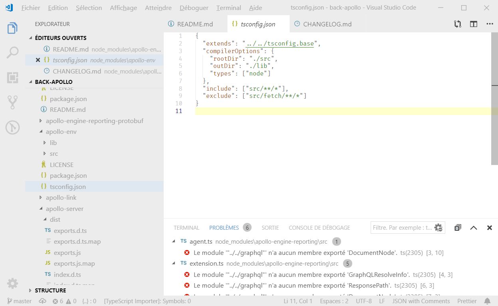

# Flat Light Theme for Visual Studio Code with lots of zen

[](https://marketplace.visualstudio.com/items?itemName=oub.zen-flat-light) [](https://marketplace.visualstudio.com/items?itemName=oub.zen-flat-light) [](https://marketplace.visualstudio.com/items?itemName=oub.zen-flat-light) [](https://github.com/oub/vscode-zen-flat-light/blob/master/LICENSE.md)

## Screenshot



## Installation

Search for *Zen Flat Light* from the extension installer within VSCode or execute below line in the **command palette** (**F1**/**Ctrl+Shift+P**):
```
ext install zen-flat-light
```

# Issues

Please report all the errors and/or annoyances that you see on the [issues](https://github.com/oub/vscode-zen-flat-light/issues) page.